<!-- 表紙 -->
<div class="cover-container">
  <div class="cover-inner">
    <div class="title">
      <h1>Webアプリ開発研修</h1>
      <h3 class="cover-title">AWS と 【Laravel】で</br>書籍販売ＥＣサイトを作る【Breeze(Inertia)】</h3>
    </div>
    <div class="subtitle">
      <div class="issued">発行日：2025/09/26</div>
      <div class="author">著者：システム開発推進Ｇ 畠山 慧</div>
    </div>
  </div>
</div>

# 目次

- [目次](#目次)
- [開発の目的・背景](#開発の目的背景)
  - [学習の目的](#学習の目的)
  - [AWSを選んだ理由](#awsを選んだ理由)
  - [Vue.jsを選んだ理由](#vuejsを選んだ理由)
- [実装アプリ内容](#実装アプリ内容)
  - [実装したアプリ](#実装したアプリ)
  - [実装画面・機能](#実装画面機能)
- [仕様について](#仕様について)
  - [共通ヘッダー](#共通ヘッダー)
  - [Bungo 商品一覧](#bungo-商品一覧)
  - [Bungo 商品詳細](#bungo-商品詳細)
  - [Bungo 商品削除](#bungo-商品削除)
  - [Bungo 商品登録](#bungo-商品登録)
  - [Bungo 商品編集](#bungo-商品編集)
  - [Bungo カート(商品購入)](#bungo-カート商品購入)
  - [Bungo カート(商品)](#bungo-カート商品)
  - [開発・工程スケジュール](#開発工程スケジュール)
- [環境構築について](#環境構築について)
  - [IPアドレス制御](#ipアドレス制御)
  - [アプリディレクトリ構成例](#アプリディレクトリ構成例)
- [工程で苦労した点](#工程で苦労した点)
- [詳細設計書の作成について](#詳細設計書の作成について)
  - [DB設計](#db設計)
  - [ログイン](#ログイン)
  - [パスワードリセット](#パスワードリセット)
  - [ユーザー作成](#ユーザー作成)
  - [商品一覧・検索](#商品一覧検索)
  - [商品登録](#商品登録)
  - [商品編集](#商品編集)
  - [商品削除](#商品削除)
  - [商品購入初期表示](#商品購入初期表示)
  - [カートへ追加](#カートへ追加)
  - [商品購入](#商品購入)
  - [購入履歴](#購入履歴)
- [工程で苦労した点](#工程で苦労した点-1)
- [単体テスト仕様書の作成](#単体テスト仕様書の作成)
- [コーディング作業について](#コーディング作業について)
  - [Laravel開発重要ポイント　　~viエディタでもなんとかなった理由~](#laravel開発重要ポイントviエディタでもなんとかなった理由)
  - [開発例 画像表示](#開発例-画像表示)
- [工程で苦労した点](#工程で苦労した点-2)
- [テスト実施について](#テスト実施について)
- [リリース後の対応について](#リリース後の対応について)
- [かかった費用](#かかった費用)

# 開発の目的・背景

## 学習の目的

- モダンな開発環境でも活躍できるエンジニアになるため
- 新卒の頃と比べて自分がどのくらい成長したか実感し、自信を付けたい

## AWSを選んだ理由

- AWSが完全未経験なのでいい機会だと思ったから
- デスクトップPCしか持っていない事もあり、出社時も在宅時もオンラインで開発を完結させたかったから

## Vue.jsを選んだ理由

- 最近流行りのモダン言語でWebアプリ開発をしてみたかったから
- なんか名前が格好良かったから

# 実装アプリ内容

## 実装したアプリ

書籍販売ECサイト Bungo<br>
アプリ名とアプリロゴはGeminiに考えてもらいました。


## 実装画面・機能

<table>
  <thead>
    <tr>
      <th>画面</th>
      <th>主要機能</th>
      <th>新規開発</th>
      <th>管理者権限</th>
      <th>Laravel URL</th>
    </tr>
  </thead>
  <tbody>
    <tr>
      <td>ログイン</td>
      <td>ログインする</td>
      <td>-</td>
      <td>-</td>
      <td>/login</td>
    </tr>
    <tr>
      <td>パスワードリセット</td>
      <td>パスワードリセットする</td>
      <td>-</td>
      <td>-</td>
      <td>/password/reset</td>
    </tr>
    <tr>
      <td>アカウント新規作成</td>
      <td>ログインユーザーのアカウントを新規作成する</td>
      <td>-</td>
      <td>-</td>
      <td>/register</td>
    </tr>
    <tr>
      <td>商品一覧</td>
      <td>Welcomおよび<br>DashBoaod的な立ち位置で商品を表示する</td>
      <td>〇</td>
      <td>-</td>
      <td>/item/index</td>
    </tr>
    <tr>
      <td rowspan="2">商品詳細</td>
      <td>1商品の詳細を表示する</td>
      <td>〇</td>
      <td>-</td>
      <td>/item/{id}</td>
    </tr>
    <tr>
      <td>1商品を削除する</td>
      <td>〇</td>
      <td>〇</td>
      <td>/item/{id}/delete</td>
    </tr>
    <tr>
      <td>商品登録</td>
      <td>新しい商品を登録する</td>
      <td>〇</td>
      <td>〇</td>
      <td>/item/create</td>
    </tr>
    <tr>
      <td>商品編集</td>
      <td>登録されている商品情報を編集する</td>
      <td>〇</td>
      <td>〇</td>
      <td>/item/{id}/edit</td>
    </tr>
    <tr>
      <td>カート(商品購入)</td>
      <td>カートに追加された商品情報を表示する</td>
      <td>〇</td>
      <td>-</td>
      <td>/purchase/index</td>
    </tr>
    <tr>
      <td>購入履歴</td>
      <td>購入した商品情報を表示する</td>
      <td>〇</td>
      <td>-</td>
      <td>/purchase/show</td>
    </tr>
  </tbody>
<table>  

次ページ以降で開発した各機能の仕様について説明します

# 仕様について

### 共通ヘッダー

- ログイン <text color='red'>※ログイン前のみ</text>

- アカウント新規作成　<text color='red'>※ログイン前のみ</text>
- 商品一覧
- 商品登録
- カート
- 購入履歴
- ログアウト

### Bungo 商品一覧

<table>
    <tr>
        <td></td>
        <td>&nbsp;</td>
        <td>
        <div>
            <ul>
            <li>ログイン前は詳細を見るボタンが表示されない
            <li>検索ボタンを押下後にDBに登録されているデータが表示される</li>
            <li>検索条件は「商品名」「著者名」の部分一致</li>
            <li>ページネーションは8件まで表示可能</li>
            <li>/public/images/配下の画像を参照する</li>
            </ul>
        </div>
        </td>
    </tr>
    <tr>
      <td></td>
      <td></td>
      <td><li>ログイン後は詳細を見るボタンが表示される。ヘッダーも違う。</td>
    </tr>
    <tr>
      <td></td>
      <td></td>
      <td><li>管理者の場合ヘッダーが違う</td>
    </tr>
</table>

### Bungo 商品詳細

<table>
    <tr>
        <td></td>
        <td>&nbsp;</td>
        <td>
        <div>
            <ul>
            <li>商品一覧画面で選択した書籍の詳細表示ができる</li>
            <li>「編集する」ボタン押下により商品編集画面へ遷移する</li>
            <li>「カートへ追加」ボタン押下によりカートへ商品を追加とワークテーブルへの登録をする</li>
            <li>管理者権限でログイン後のみ「削除する」ボタン押下できる</li>
            </ul>
        </div>
        </td>
    </tr>
    <tr>
      <td></td>
      <td></td>
      <td><li>管理者でなければボタンは押せない</td>
    </tr>
</table>

```html
<div class="p-2 w-full">
  <Link v-if="$page.props.auth.user.name === 'root'" as="button" :href="route('items.edit', { item: item.id })">編集する</Link>
</div>
<div class="mt-20 p-2 w-full">
  <button v-if="$page.props.auth.user.name === 'root'" @click="deleteItem(item.id)">削除する</button>
</div>
```

アクセス制御はユーザー名でオンコーディングなので最悪です。<br>
AWSにはアプリの特定のURLにアクセスできるユーザーを管理する方法があるはずですが、ここまで手をかけられませんでした。

### Bungo 商品削除

<table>
    <tr>
        <td></td>
        <td>&nbsp;</td>
        <td>
        <div>
            <ul>
            <li>「削除する」ボタン押下により商品を商品管理テーブルから削除する</li>
            <li>/public/images/配下の対象の画像を削除する</li>
            </ul>
        </div>
        </td>
    </tr>
</table>

### Bungo 商品登録

<table>
    <tr>
        <td></td>
        <td>&nbsp;</td>
        <td>
        <div>
            <ul>
            <li>情報等を入力し、登録ボタンを押下後、　DBにデータとして格納される</li>
            <li> 必須項目のバリデーションチェックを行う。</li>
            <li> 画像ファイルを /public/images/にYYYYmmDDhhMMss.png形式で配備<br>
→ なぜかsvgやjpgは描画エラーで使用できなかったため</li>
            </ul>
        </div>
        </td>
    </tr>
</table>

### Bungo 商品編集

<table>
    <tr>
        <td></td>
        <td>&nbsp;</td>
        <td>
        <div>
            <ul>
            <li>商品詳細画面からの情報を編集画面に渡す</li>
            <li> 必須項目のバリデーションチェックを行う</li>
            <li>変更がある箇所のみ書籍の更新を行う</li>
            <li>画像ファイルは変更がある場合のみ更新する</li>
            </ul>
        </div>
        </td>
    </tr>
</table>

### Bungo カート(商品購入)

<table>
    <tr>
        <td></td>
        <td>&nbsp;</td>
        <td>
        <div>
            <ul>
            <li>ログインユーザのセッションIDに紐づくpurchase_statusが0の商品を表示する</li>
            <li> 購入するボタン押下でDB内のpurchase_statusが1に更新される</li>
            <li>選択した商品の合計金額を算出表示する</li>
            <li>無選択はエラーとする</li>
            </ul>
        </div>
        </td>
    </tr>
</table>

### Bungo カート(商品)

<table>
    <tr>
        <td></td>
        <td>&nbsp;</td>
        <td>
        <div>
            <ul>
            <li>DB内のpurchase_statusが1の、<br>
            セッションIDに紐づく購入商品を表示する</li>
            </ul>
        </div>
        </td>
    </tr>
</table>

## 開発・工程スケジュール

# 環境構築について

予定期間：2025年9月1日 ~ 9月5日 予定　<br>
実施期間：2025年9月1日 ~ 9月10日 完了<br><br>

EC2上にLAMP環境を構築し、<br>フロントがVue.jsのMVCモデルアプリを開発しました。<br>


<div class="page"/>

<table>
  <thead>
    <tr>
      <th>項目</th>
      <th>内容</th>
      <th>項目</th>
      <th>内容</th>
    </tr>
  </thead>
  <tbody>
    <tr>
      <td>開発環境</td>
      <td>AWS</td>
      <td>開発言語</td>
      <td>Vue.js、php、bash</td>
    </tr>
    <tr>
      <td>OS</td>
      <td>Amazon Linux2</td>
      <td>フレームワーク</td>
      <td>Laravel</td>
    </tr>
    <tr>
      <td>DNSサーバ</td>
      <td>Route53</td>
      <td>ルーティング</td>
      <td>Inertia</td>
    </tr>
    <tr>
      <td>SSL/TLS証明書発行</td>
      <td>ACM</td>
      <td>Webサーバ</td>
      <td>Apache</td>
    </tr>
    <tr>
      <td>https化</td>
      <td>ALB</td>
      <td>コーディング</td>
      <td>9割vi、1割VScode</td>
    </tr>
    <tr>
      <td>データベース</td>
      <td>Amazon Aurora DB MySQL</td>
      <td>ソース管理</td>
      <td>Github</td>
    </tr>
    <tr>
      <td>外部ストレージ</td>
      <td>S3 ※今回は使用していない</td>
      <td>ドメイン取得</td>
      <td>お名前ドットコム</td>
    </tr>
  </tbody>
</table>

<div class="page"/>

## IPアドレス制御

図では表現できませんでしたが、セキュリティグループを使用しています。<br>
インバウンドルールで (ホワイトリスト的に) アクセスするIPアドレスの制御を可能にしています。


## アプリディレクトリ構成例

<pre>
.
├── .env
├── app
│        └── Controller、Modelとか
├── artisan
├── config
├── database
│        └── テーブル定義
├── package-lock.json
├── package.json
├── public
│        ├── images
│        └── 外部公開用ページ群
├── resources
│        └──  Vueファイル
├── routes
│        └──  web.php
├── storage
</pre>

# 工程で苦労した点

<ul style="margin-top: 20px; margin-bottom: 20px;">
  <li>AWSの画面がネットに載っている情報と違う<br>→なんやかんやQiitaが一番参考になった</li>
  <li>SSL/TLS証明書の登録がなんかうまくいかない<br>→フレームワークでHttpsをリダイレクトする設定が必要だった</li>
  <li>DBのクエリエディタが使えない<br>→設定漏れ</li>
  <li>貸し出しPCではGitHubのプルリクエストへアクセスできない</li>
  <li>VSCode拡張機能のSSH接続でEC2上のソースはいじれるが、接続断が多発<br>→すべて諦めてviエディタで開発</li>
  <li>npm run buildがEC2上で動かない<br>
    →突然npmが使えなくなったりするバグ、英語勉強しといてよかった...
  </li>
</ul>

<div style="border: 1px solid #ccc; padding: 15px; max-width: 800px; background-color: #f9f9f9;">
  <h3>🔗 GitHub Issue #279</h3>
  <p>
    <strong>Issue:</strong> "laravel-vite-plugin" resolved to an ESM file #279
    <a href="https://github.com/laravel/vite-plugin/issues/279" target="_blank">▶ GitHubで詳細を見る</a>
  </p>
</div>

# 詳細設計書の作成について

予定期間：2025年9月5日 ~ 9月10日 予定　<br>
実施期間：2025年9月10日 ~ 9月11日 完了<br><br>

## DB設計

- ログインするユーザー
- 商品
- 購入状態
を管理するテーブルを作成しました。


<div class="page"/>

## ログイン

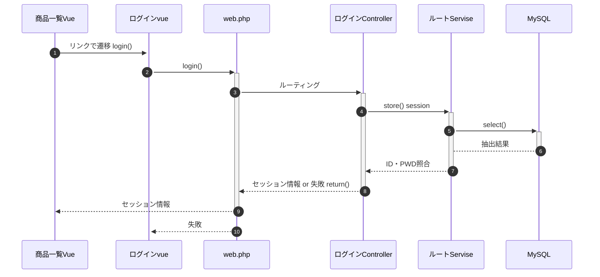

<div class="page"/>

## パスワードリセット

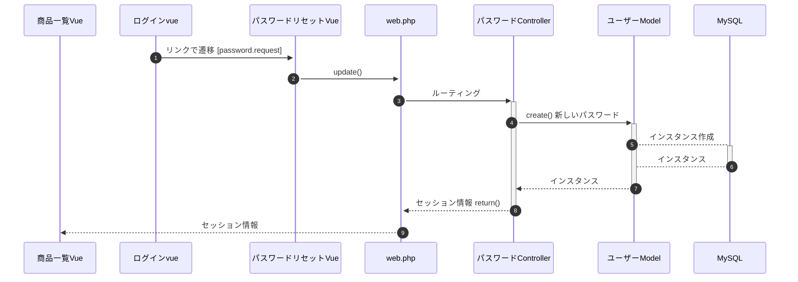

<div class="page"/>

## ユーザー作成

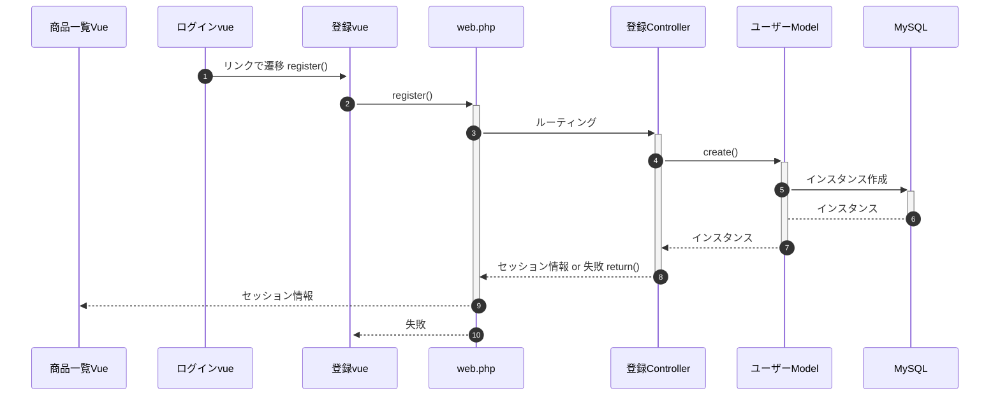

<div class="page"/>

## 商品一覧・検索

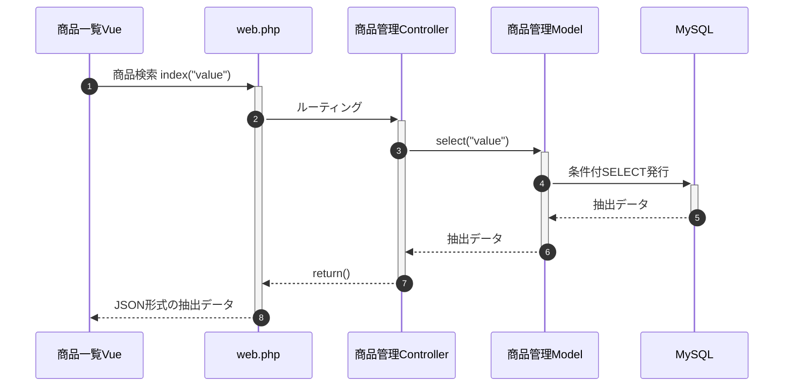

<div class="page"/>

## 商品登録

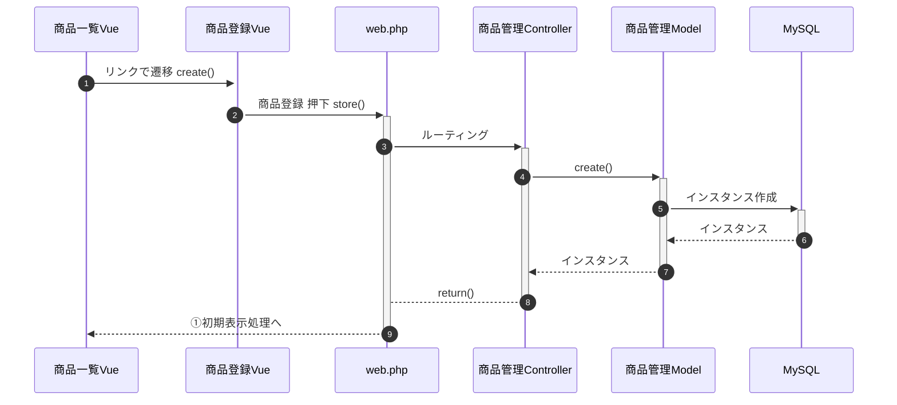

<div class="page"/>

## 商品編集

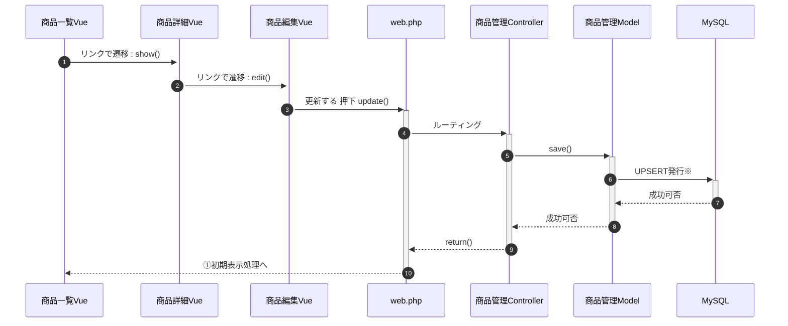

<div class="page"/>

## 商品削除

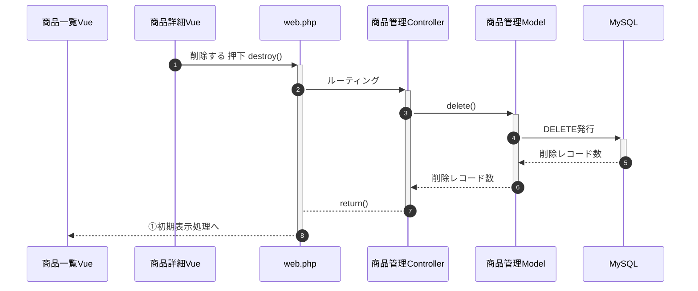

<div class="page"/>

## 商品購入初期表示

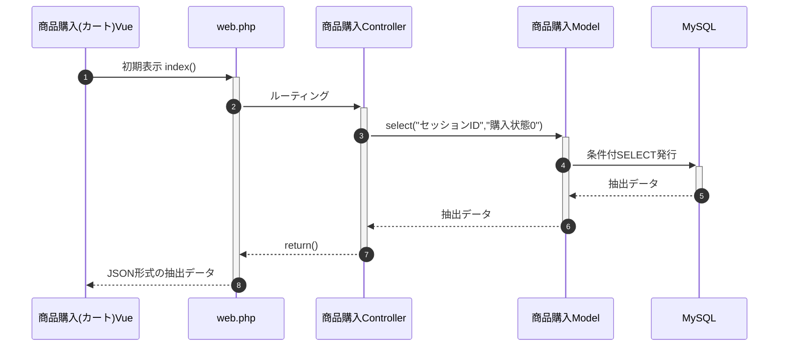

<div class="page"/>

## カートへ追加

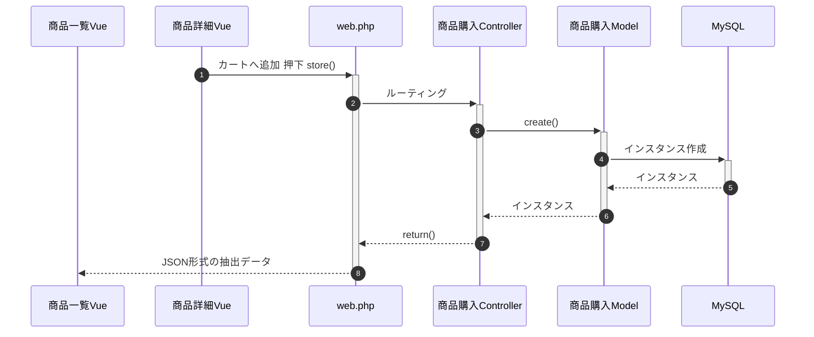

<div class="page"/>

## 商品購入

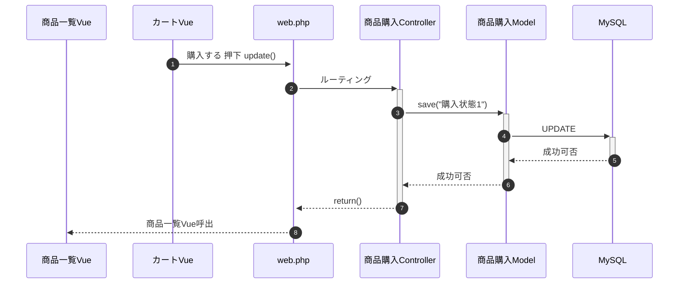

<div class="page"/>

## 購入履歴

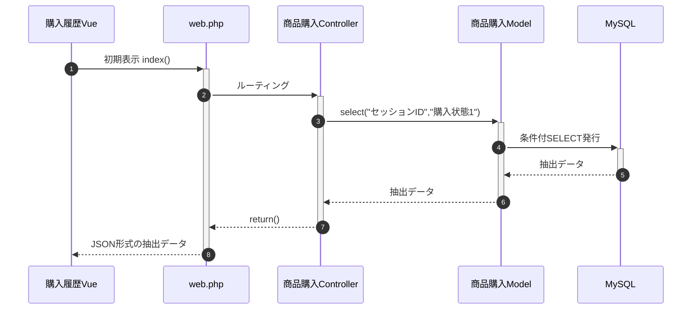

# 工程で苦労した点

- ログイン-ログアウトはLaravelフレームワークのテンプレート機能で実装済みだったが、中身の解析に時間がかかった。<br>図に落とし込んだが,
合っているかは不安。<br>独自の認証機能を使うなら外すのに時間かかりそう。
- Laravelのローカルクエリスコープを利用しているのでSQLは直接書かない設計にできた<br>→中身で何やっているか理解しないといけなかった。
- saveメソッドがUPSERTっぽくふるまっているが厳密には違うらしい。

# 単体テスト仕様書の作成

正直、あまり難しいことをしてないので省略します。<br>
バリデーションチェック、ログイン前後のメニュー確認程度です。

# コーディング作業について

## Laravel開発重要ポイント　　~viエディタでもなんとかなった理由~

**1. Artisanコマンドを使い倒す**

コーディングを最速で行うための必須コマンドで、かなり強力です。<br>

例えば、在庫管理の機能を追加するとします。

```bash
php artisan make:model Zaiko -a
```

このコマンドで以下のファイルが一括生成されます。

- app/Models/Post.php (モデル SQL)
- database/factories/PostFactory.php (ファクトリ)
- database/migrations/xxx_create_zaiko_table.php (マイグレーション DBテーブル)
- app/Http/Controllers/PostController.php (コントローラ)
- app/Policies/PostPolicy.php (ポリシー アクセス制御とか)
- database/seeders/zaikoseeder.php (シーダー　DBデータ準備)
- app/Http/Requests/StoreZaikoRequest.php（バリデーションルール）
- app/Http/Requests/UpdateZaikoRequest.php（バリデーションルール）

手作業でファイルを生成するよりも安全で、高速に新規開発が出来ます。<br>
さらに、Controllerも見てみると標準で以下のソースが記載されています。

<div class="page"/>

```php
<?php

namespace App\Http\Controllers;

use App\Http\Requests\StoreZaikoRequest;
use App\Http\Requests\UpdateZaikoRequest;
use App\Models\Zaiko;
use Illuminate\Http\Request;
use Inertia\Inertia;
use lluminate\Support\Facades\Auth;

class ZaikoController extends Controller
{
    /**
     * Display a listing of the resource.
     *
     * @return \Illuminate\Http\Response
     */
    public function index(Request $request)
    {
        // 
    }

    /**
     * Show the form for creating a new resource.
     *
     * @return \Illuminate\Http\Response
     */
    public function create()
    {
        //
    }

    /**
     * Store a newly created resource in storage.
     *
     * @param  \App\Http\Requests\StoreZaikoRequest  $request
     * @return \Illuminate\Http\Response
     */
    public function store(StoreZaikoRequest $request)
    {
        // 
    }

    /**
     * Display the specified resource.
     *
     * @param  \App\Models\Zaiko  $zaiko
     * @return \Illuminate\Http\Response
     */
    public function show(Request $request)
    {
        // 
    }

    /**
     * Show the form for editing the specified resource.
     *
     * @param  \App\Models\Zaiko  $zaiko
     * @return \Illuminate\Http\Response
     */
    public function edit(Zaiko $zaiko)
    {
        //
    }

    /**
     * Update the specified resource in storage.
     *
     * @param  \App\Http\Requests\UpdateZaikoRequest  $request
     * @param  \App\Models\Zaiko  $zaiko
     * @return \Illuminate\Http\Response
     */
    public function update(UpdateZaikoRequest $request)
    {
        // 
    }
    

    /**
     * Remove the specified resource from storage.
     *
     * @param  \App\Models\Zaiko  $zaiko
     * @return \Illuminate\Http\Response
     */
    public function destroy(Zaiko $zaiko)
    {
        //
    }
}
```

<div class="page"/>

勿論、Controllerだけ作ること可能です。<br>
Artisanコマンドにより開発時間の大幅な短縮、コード品質の向上、チーム開発の効率化が担保されます。

一番使ったのは下記コマンドで、ルーティングの設定を見ることが出来ます。

```bash
php artisan route:list

 GET|HEAD        / .................................................................... WelcomeController@index
  GET|HEAD        _debugbar/assets/javascript ...... debugbar.assets.js › Barryvdh\Debugbar › AssetController@js
  GET|HEAD        _debugbar/assets/stylesheets ... debugbar.assets.css › Barryvdh\Debugbar › AssetController@css
  DELETE          _debugbar/cache/{key}/{tags?} debugbar.cache.delete › Barryvdh\Debugbar › CacheController@del…
  GET|HEAD        _debugbar/clockwork/{id} debugbar.clockwork › Barryvdh\Debugbar › OpenHandlerController@clock…
  GET|HEAD        _debugbar/open ....... debugbar.openhandler › Barryvdh\Debugbar › OpenHandlerController@handle
  POST            _debugbar/queries/explain debugbar.queries.explain › Barryvdh\Debugbar › QueriesController@ex…
  POST            _ignition/execute-solution ignition.executeSolution › Spatie\LaravelIgnition › ExecuteSolutio…
  GET|HEAD        _ignition/health-check . ignition.healthCheck › Spatie\LaravelIgnition › HealthCheckController
  POST            _ignition/update-config ignition.updateConfig › Spatie\LaravelIgnition › UpdateConfigControll…
  GET|HEAD        api/user ..................................................................................... 
  GET|HEAD        confirm-password .................. password.confirm › Auth\ConfirmablePasswordController@show
  POST            confirm-password .................................... Auth\ConfirmablePasswordController@store
  GET|HEAD        dashboard .......................................................................... dashboard
  POST            email/verification-notification verification.send › Auth\EmailVerificationNotificationControl…
  GET|HEAD        forgot-password ................... password.request › Auth\PasswordResetLinkController@create
  POST            forgot-password ...................... password.email › Auth\PasswordResetLinkController@store
  GET|HEAD        items ..................................................... items.index › ItemController@index
  POST            items ..................................................... items.store › ItemController@store
  GET|HEAD        items/create ............................................ items.create › ItemController@create
  GET|HEAD        items/{item} ................................................ items.show › ItemController@show
  PUT|PATCH       items/{item} ............................................ items.update › ItemController@update
  DELETE          items/{item} .......................................... items.destroy › ItemController@destroy
  GET|HEAD        items/{item}/edit ........................................... items.edit › ItemController@edit
  GET|HEAD        login ..................................... login › Auth\AuthenticatedSessionController@create
  POST            login .............................................. Auth\AuthenticatedSessionController@store
  POST            logout .................................. logout › Auth\AuthenticatedSessionController@destroy
  PUT             password .................................... password.update › Auth\PasswordController@update
  GET|HEAD        profile ................................................ profile.edit › ProfileController@edit
  PATCH           profile ............................................ profile.update › ProfileController@update
  DELETE          profile .......................................... profile.destroy › ProfileController@destroy
```

<div class="page"/>

DBテーブル作るなら

```bash
php artisan migrate
```

DBデータ入れるなら

```bash
php artisan migrate:fresh --seed   
```

ローカルでデバッグするなら

```bash
php artisan serve   
```

**2. npmコマンドはエラーチェックに有効**
このコマンドはローカル上でデバッグ確認するときによく使います。

```bash
npm run dev
```

Vue.jsを変更したらビルドすることで/publicフォルダにjsファイルが生成され、本番リリースが出来ます。

```bash
npm run build
```

これらのコマンドは、Vue.jsで「{」とか、「;」 とか抜けていないか構文チェックをしてくれるのでそこそこ助かりました。<br>
その他エラーはブラウザでF12[開発者モード]で確認し、ぐりぐり進めていきました。

<div class="page"/>

## 開発例 画像表示

以下の例では、どうやって商品一覧画面を表示しているのかについて紹介します。<br>
routes/web.php

```bash
<?php

use App\Http\Controllers\ProfileController;
use Illuminate\Foundation\Application;
use Illuminate\Support\Facades\Route;
use Inertia\Inertia;
use App\Http\Controllers\ItemController;
use App\Http\Controllers\PurchaseController;

Route::resource('items', ItemController::class)
        ->middleware(['auth', 'verified']);
```

resources/js/Pages/Items/Index.vue

```bash
<script setup>
import AuthenticatedLayout from '@/Layouts/AuthenticatedLayout.vue';
import { Head, Link } from '@inertiajs/vue3';
import Pagination from '@/Components/Pagination.vue';
import FlashMessage from '@/Components/FlashMessage.vue';
import { Inertia } from '@inertiajs/inertia'
import { ref } from 'vue'

defineProps({
  items: Object
})

const search = ref('')
const searchItems = () => {
    Inertia.get(route('items.index', { search: search.value }))
}
</script>

<template>

  <Head title="商品一覧" />

  <AuthenticatedLayout>
    <template #header>
      <h2 class="font-semibold text-xl text-gray-800 leading-tight">商品一覧</h2>
    </template>
    <FlashMessage />
    
    <div class="py-12">
      <div class="max-w-7xl mx-auto sm:px-6 lg:px-8">
        <div class="bg-white overflow-hidden shadow-sm sm:rounded-lg">
            <div class="flex w-full justify-center items-end mt-6">
              <div>
                 <input input type="text" name="search" v-model="search">
              </div>
              <button @click="searchItems" focus:outline-none hover:bg-indigo-600 rounded text-lg">検索</button>
            </div>  

          <div class="p-6 text-gray-900">
            <div class="grid grid-cols-1 sm:grid-cols-2 md:grid-cols-4 gap-6 p-4">
              <div v-for="item in items.data" :key="item.id"
                class="bg-white shadow rounded-lg p-4 flex flex-col items-center">
                
                <h3 class="text-gray-500 text-xs tracking-widest title-font mb-1">{{ item.author }}</h3>
                <h2 class="text-gray-900 title-font text-lg font-medium">{{ item.name }}</h2>
                <p class="mt-1">&yen{{ item.price.toLocaleString() }}</p>
                <Link class="text-blue-400" :href="route('items.show', { item: item.id })">詳細を見る</Link>
              </div>
            </div>
          </div>
        <div class="flex justify-center mb-4"> 
        <Pagination class="mt-6" :links="items.links"></Pagination>
        </div>
        </div>
      </div>
    </div>
  </AuthenticatedLayout>
</template>
```

<div class="page"/>

app/Http/Controllers/ItemController.php

```php
<?php

namespace App\Http\Controllers;

use App\Http\Requests\StoreItemRequest;
use App\Http\Requests\UpdateItemRequest;
use App\Models\Item;
use Inertia\Inertia;
use Illuminate\Support\Facades\Storage;
use Illuminate\Http\Request;

class ItemController extends Controller
{
    /**
     * Display a listing of the resource.
     *
     * @return \Illuminate\Http\Response
     */
    public function index(Request $request)
    {
        $items = Item::searchItems($request->search)
                ->select('id','name','author','price','is_selling','image_id')->paginate(8)->through(function ($item) {
                    return [
                       'id' => $item->id,
                       'name' => $item->name,
                       'author' => $item->author,
                       'price' => $item->price,
                       'is_selling' => $item->is_selling,
                       'image_id' => $item->image_id, // 元のimage_idも残しておく
                       'image_url' => asset('images/' . $item->image_id), // asset()を使ってURLを生成
                    ];
                  });

        return Inertia::render('Items/Index',[
            'items' => $items
        ]);
    }
}
```

<div class="page"/>

/app/Models/Item.php

```php
<?php

namespace App\Models;

use Illuminate\Database\Eloquent\Factories\HasFactory;
use Illuminate\Database\Eloquent\Model;
use app\Models\Item;

class Item extends Model
{
    use HasFactory;
    protected $fillable =[
 'name',
 'author',
 'memo',
 'price',
 'is_selling',
 'image_id',
    ];

    public function purchases()
    {
       return $this->belongsToMany(Purchase::class)
       ->withPivot('quantity');
    }

    public function scopeSearchItems($query, $input = null)
    {
        if(!empty($input)){
            if(Item::where('name', 'like', '%' .  $input . '%' )
            ->orWhere('author', 'like', $input . '%')->exists())
                {
                return $query->where('name', 'like', '%' . $input . '%' )
                ->orWhere('author', 'like', $input . '%');
                }
        }
    }
}
```

よく見たら著者名が前方一致になってました。

# 工程で苦労した点

- テーブル定義はmigrationファイルで定義するのではなく、クエリエディタを使ってSQL実行したかった。
- Welcomeページをいじろうとしたら、全然うまくいかなかった。<br>
  →Laravelではよくあることらしい。フルパス表記で解決

```php
<?php

use App\Http\Controllers\ProfileController;
use Illuminate\Foundation\Application;
use Illuminate\Support\Facades\Route;
use Inertia\Inertia;
use App\Http\Controllers\ItemController;
use App\Http\Controllers\PurchaseController;


Route::resource('items', ItemController::class)
        ->middleware(['auth', 'verified']);

Route::middleware(['auth', 'verified'])->group(function () {

    Route::controller(PurchaseController::class)->group(function () {
        Route::get('/purchases', 'index')->name('purchases.index');
        Route::post('/purchases', 'store')->name('purchases.store');
        Route::get('/purchasese', 'show')->name('purchases.show');
        Route::put('/purchases', 'update')->name('purchases.update');
    });

});

Route::get('/',[App\Http\Controllers\WelcomeController::class,'index']);
/*
Route::get('/', function () {
    return Inertia::render('Welcome', [
        'canLogin' => Route::has('login'),
        'canRegister' => Route::has('register'),
        'laravelVersion' => Application::VERSION,
        'phpVersion' => PHP_VERSION,
    ]);
});
*/
Route::get('/dashboard', function () {
    return Inertia::render('Dashboard');
})->middleware(['auth', 'verified'])->name('dashboard');

Route::middleware('auth')->group(function () {
    Route::get('/profile', [ProfileController::class, 'edit'])->name('profile.edit');
    Route::patch('/profile', [ProfileController::class, 'update'])->name('profile.update');
    Route::delete('/profile', [ProfileController::class, 'destroy'])->name('profile.destroy');
```

- 貸出PCをアカデミックルームで使っていると一部機能にアクセスできなかった。

# テスト実施について

正直、あまり難しいことをしてないので省略します。<br>
バリデーションチェック、ログイン前後のメニュー確認程度です。

# リリース後の対応について

- 在庫管理の実施 後続で自作APIとか使ったら面白そう
- セッションID、cookieの設定

# かかった費用

約5,000円かかってます。思ったよりかなり高い！が感想です。<br>
ロードバランサの設定とかリリース直前にしたら安く抑えられたのかなと思います。


ドメイン取得は無料でしたが、ネームサーバー登録が高かったです。.workとか中古ドメインにすれば良かった。<br>
ちなみにインスタンスタイプはt3.micro(2Gib)、EBSは50Gibを使用しています。<br>
デフォルトで進めるとapacheのインストールでフリーズするのでちょっとだけ拡張してます。
