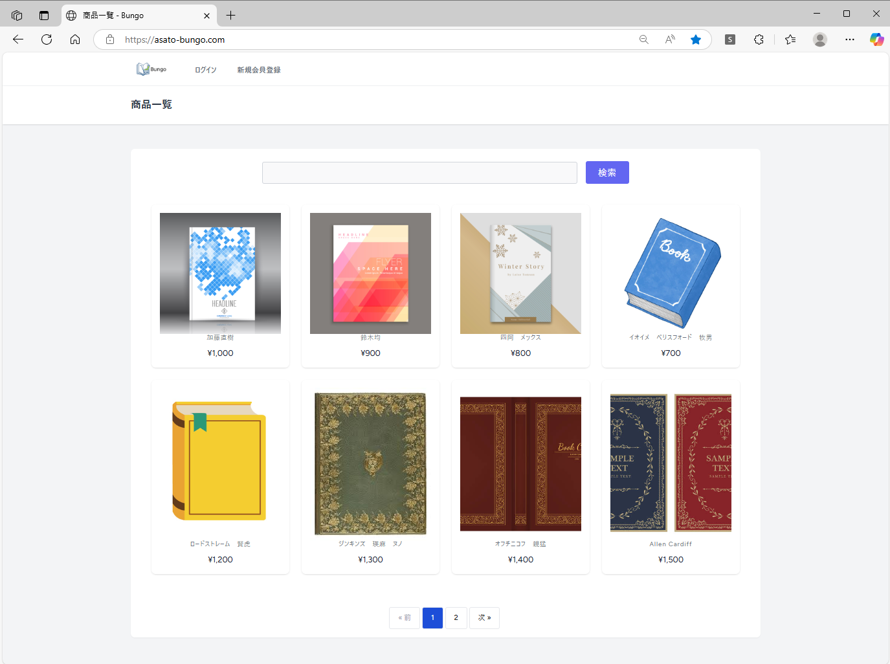
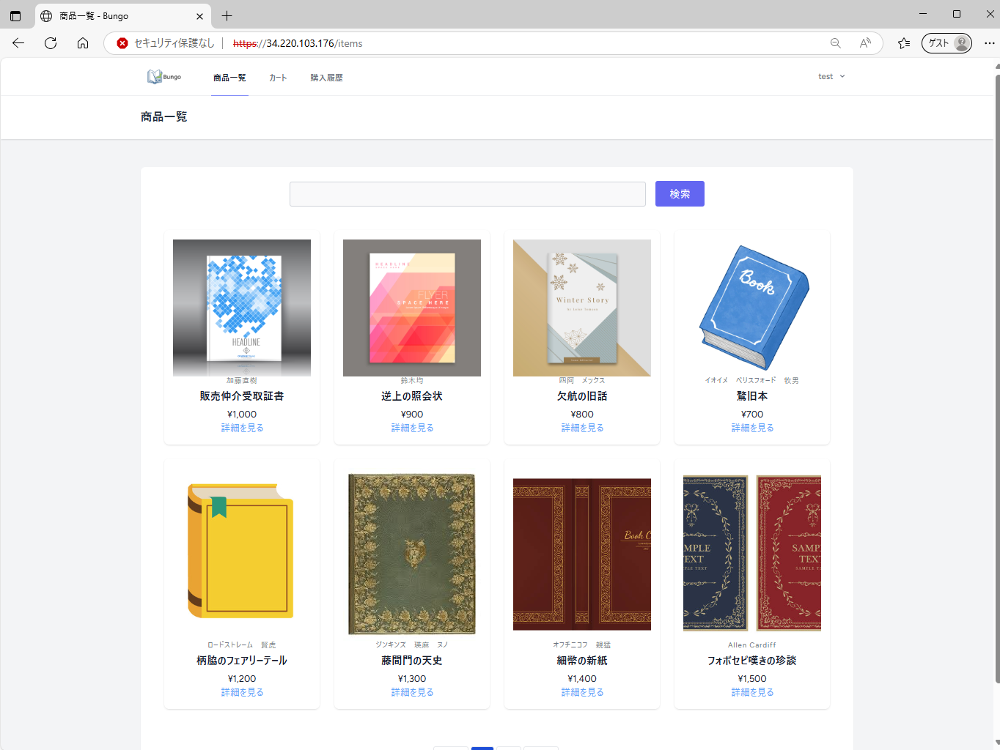
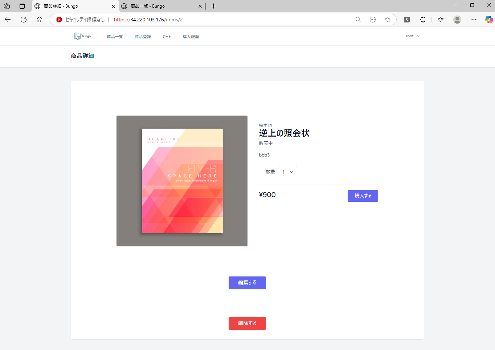
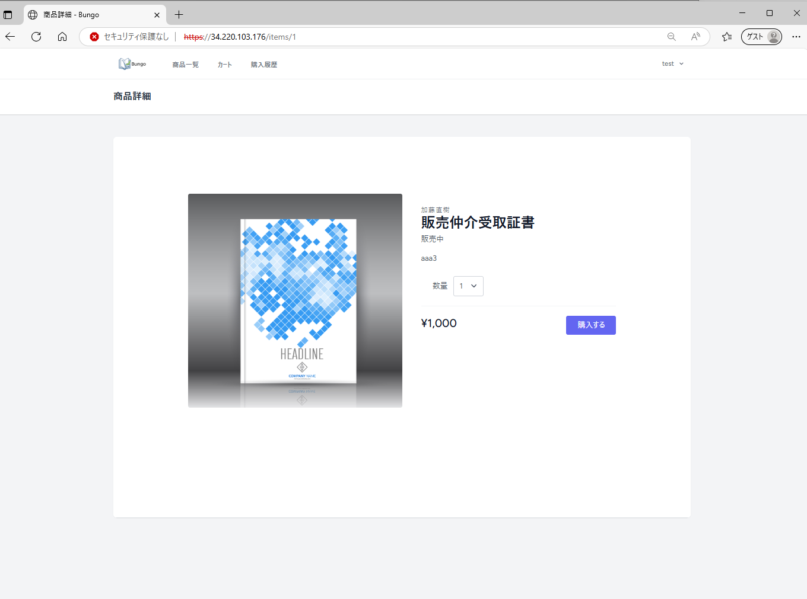
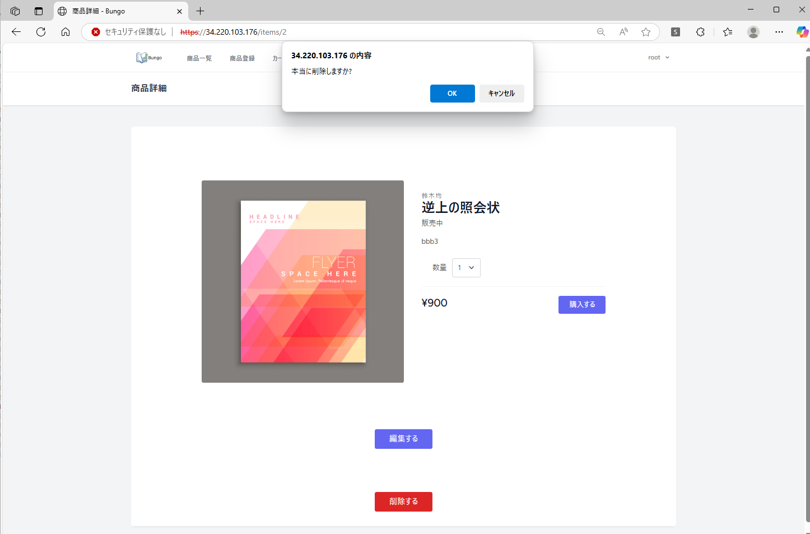
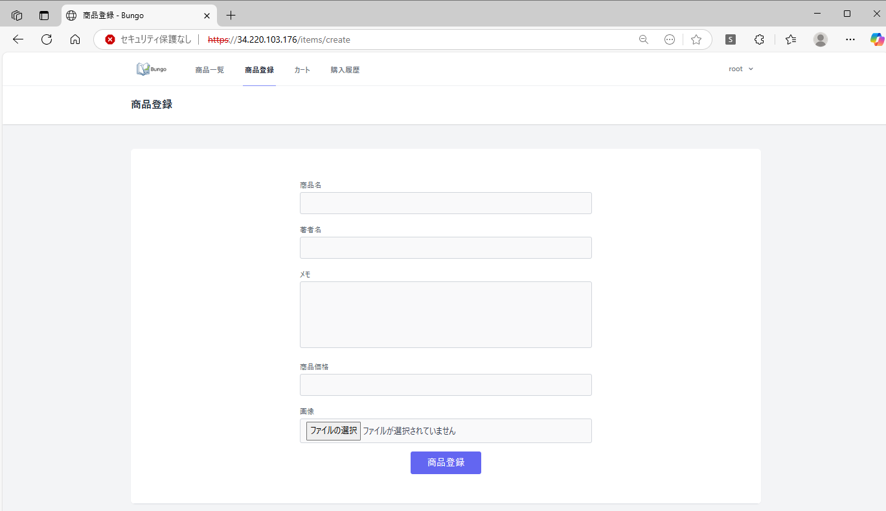
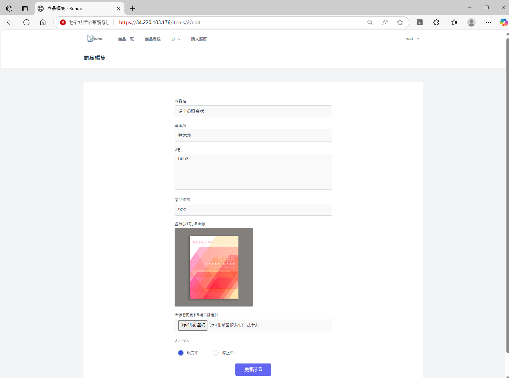
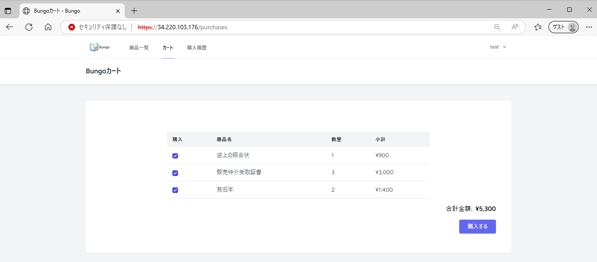
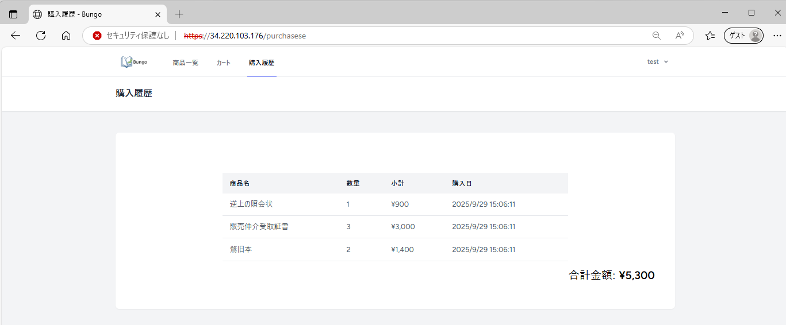

### 共通ヘッダー
* ログイン <text color='red'>※ログイン前のみ</text>
* アカウント新規作成　<text color='red'>※ログイン前のみ</text>
* 商品一覧
* 商品登録
* カート
* 購入履歴
* ログアウト

### Bungo 商品一覧
<table>
    <tr>
        <td></td>
        <td>&nbsp;</td>
        <td>
        <div>
            <ul>
            <li>ログイン前は詳細を見るボタンが表示されない
            <li>検索ボタンを押下後にDBに登録されているデータが表示される</li>
            <li>検索条件は「商品名」「著者名」の部分一致</li>
            <li>ページネーションは8件まで表示可能</li>
            <li>/public/images/配下の画像を参照する</li>
            </ul>
        </div>
        </td>
    </tr>
    <tr>
      <td></td>
      <td></td>
      <td><li>ログイン後は詳細を見るボタンが表示される。ヘッダーも違う。</td>
    </tr>
    <tr>
      <td></td>
      <td></td>
      <td><li>管理者の場合ヘッダーが違う</td>
    </tr>    
</table>


### Bungo 商品詳細
<table>
    <tr>
        <td></td>
        <td>&nbsp;</td>
        <td>
        <div>
            <ul>
            <li>商品一覧画面で選択した書籍の詳細表示ができる</li>
            <li>「編集する」ボタン押下により商品編集画面へ遷移する</li>
            <li>「カートへ追加」ボタン押下によりカートへ商品を追加とワークテーブルへの登録をする</li>
            <li>管理者権限でログイン後のみ「削除する」ボタン押下できる</li>
            </ul>
        </div>
        </td>
    </tr>
    <tr>
      <td></td>
      <td></td>
      <td><li>管理者でなければボタンは押せない</td>
    </tr>
</table>

```html
<div class="p-2 w-full">
  <Link v-if="$page.props.auth.user.name === 'root'" as="button" :href="route('items.edit', { item: item.id })">編集する</Link>
</div>
<div class="mt-20 p-2 w-full">
  <button v-if="$page.props.auth.user.name === 'root'" @click="deleteItem(item.id)">削除する</button>
</div>
```
アクセス制御はユーザー名でオンコーディングなので最悪です。<br>
AWSにはアプリの特定のURLにアクセスできるユーザーを管理する方法があるはずですが、ここまで手をかけられませんでした。

### Bungo 商品削除
<table>
    <tr>
        <td></td>
        <td>&nbsp;</td>
        <td>
        <div>
            <ul>
            <li>「削除する」ボタン押下により商品を商品管理テーブルから削除する</li>
            <li>/public/images/配下の対象の画像を削除する</li>
            </ul>
        </div>
        </td>
    </tr>
</table>

### Bungo 商品登録
<table>
    <tr>
        <td></td>
        <td>&nbsp;</td>
        <td>
        <div>
            <ul>
            <li>情報等を入力し、登録ボタンを押下後、　DBにデータとして格納される</li>
            <li> 必須項目のバリデーションチェックを行う。</li>
            <li> 画像ファイルを /public/images/にYYYYmmDDhhMMss.png形式で配備<br>
→ なぜかsvgやjpgは描画エラーで使用できなかったため</li>
            </ul>
        </div>
        </td>
    </tr>
</table>

### Bungo 商品編集
<table>
    <tr>
        <td></td>
        <td>&nbsp;</td>
        <td>
        <div>
            <ul>
            <li>商品詳細画面からの情報を編集画面に渡す</li>
            <li> 必須項目のバリデーションチェックを行う</li>
            <li>変更がある箇所のみ書籍の更新を行う</li>
            <li>画像ファイルは変更がある場合のみ更新する</li>
            </ul>
        </div>
        </td>
    </tr>
</table>

### Bungo カート(商品購入)
<table>
    <tr>
        <td></td>
        <td>&nbsp;</td>
        <td>
        <div>
            <ul>
            <li>ログインユーザのセッションIDに紐づくpurchase_statusが0の商品を表示する</li>
            <li> 購入するボタン押下でDB内のpurchase_statusが1に更新される</li>
            <li>選択した商品の合計金額を算出表示する</li>
            <li>無選択はエラーとする</li>
            </ul>
        </div>
        </td>
    </tr>
</table>

### Bungo カート(商品)
<table>
    <tr>
        <td></td>
        <td>&nbsp;</td>
        <td>
        <div>
            <ul>
            <li>DB内のpurchase_statusが1の、<br>
            セッションIDに紐づく購入商品を表示する</li>
            </ul>
        </div>
        </td>
    </tr>
</table>