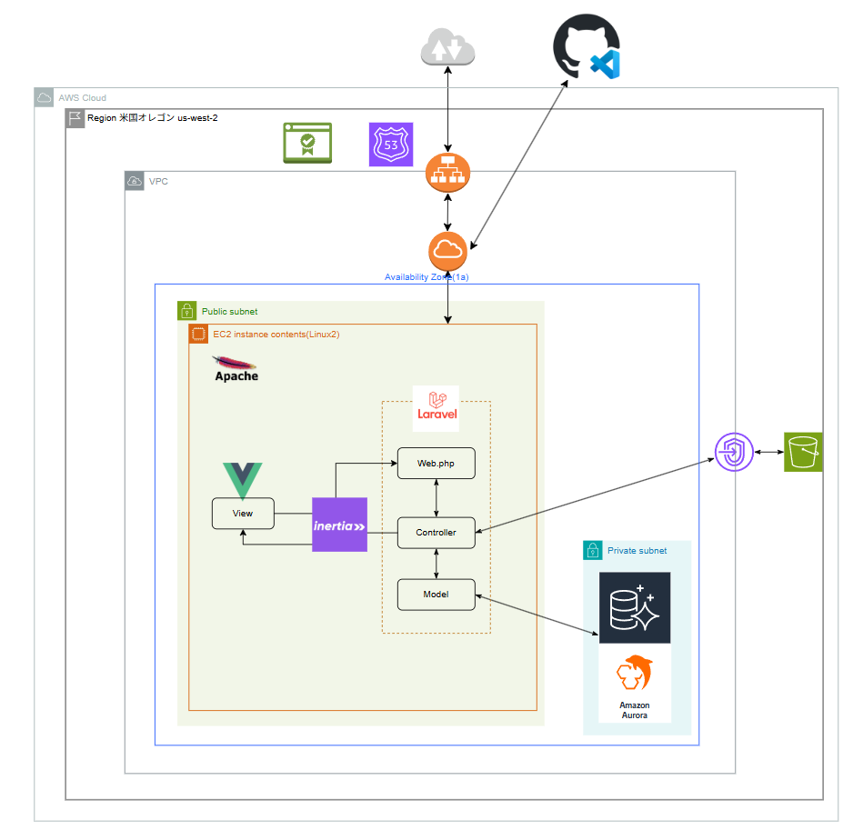
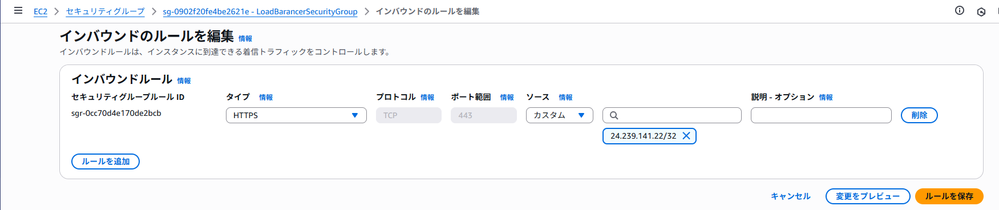

# 環境構築について

予定期間：2025年9月1日 ~ 9月5日 予定　 
実施期間：2025年9月1日 ~ 9月10日 完了  

EC2上にLAMP環境を構築し、 フロントがVue.jsのMVCモデルアプリを開発しました。 

<table>
  <thead>
    <tr>
      <th>項目</th>
      <th>内容</th>
      <th>項目</th>
      <th>内容</th>
    </tr>
  </thead>
  <tbody>
    <tr>
      <td>開発環境</td>
      <td>AWS</td>
      <td>開発言語</td>
      <td>Vue.js、php、bash</td>
    </tr>
    <tr>
      <td>OS</td>
      <td>Amazon Linux2</td>
      <td>フレームワーク</td>
      <td>Laravel</td>
    </tr>
    <tr>
      <td>DNSサーバ</td>
      <td>Route53</td>
      <td>ルーティング</td>
      <td>Inertia</td>
    </tr>
    <tr>
      <td>SSL/TLS証明書発行</td>
      <td>ACM</td>
      <td>Webサーバ</td>
      <td>Apache</td>
    </tr>
    <tr>
      <td>https化</td>
      <td>ALB</td>
      <td>コーディング</td>
      <td>9割vi、1割VScode</td>
    </tr>
    <tr>
      <td>データベース</td>
      <td>Amazon Aurora DB MySQL</td>
      <td>ソース管理</td>
      <td>Github</td>
    </tr>
    <tr>
      <td>外部ストレージ</td>
      <td>S3 ※今回は使用していない</td>
      <td>ドメイン取得</td>
      <td>お名前ドットコム</td>
    </tr>
  </tbody>
</table>

## IPアドレス制御

図では表現できませんでしたが、セキュリティグループを使用しています。 
インバウンドルールで (ホワイトリスト的に) アクセスするIPアドレスの制御を可能にしています。

## アプリディレクトリ構成例

<pre>
.
├── .env
├── app
│        └── Controller、Modelとか
├── artisan
├── config
├── database
│        └── テーブル定義
├── package-lock.json
├── package.json
├── public
│        ├── images
│        └── 外部公開用ページ群
├── resources
│        └──  Vueファイル
├── routes
│        └──  web.php
├── storage
</pre>
