# 詳細設計書の作成について

予定期間：2025年9月5日 ~ 9月10日 予定　 
実施期間：2025年9月10日 ~ 9月11日 完了  

## DB設計

* ログインするユーザー
* 商品
* 購入状態
を管理するテーブルを作成しました。

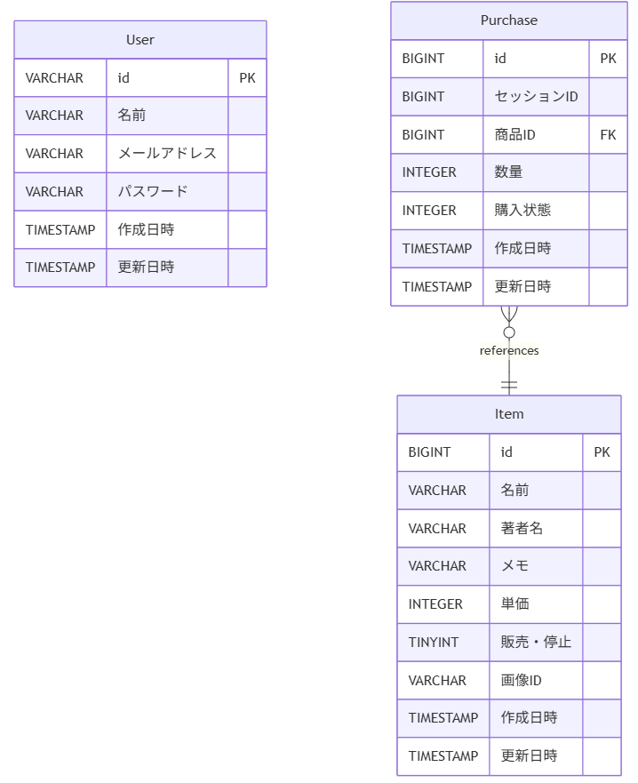

## ログイン

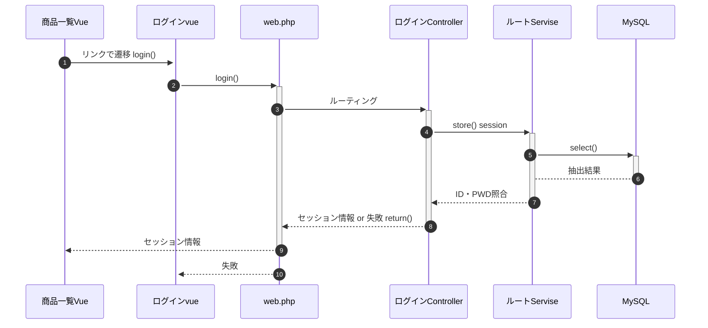

## パスワードリセット

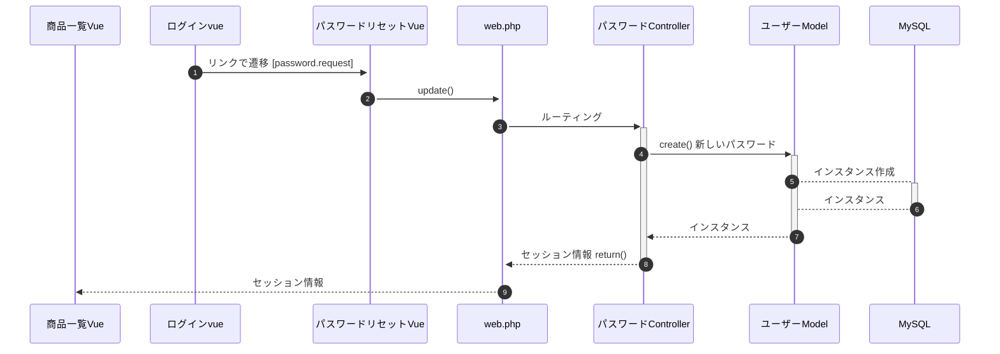

## ユーザー作成

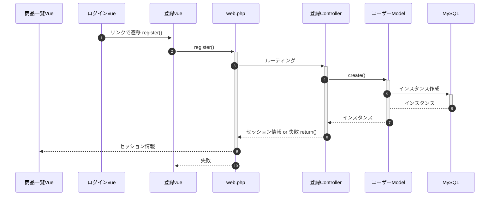

## 商品一覧・検索

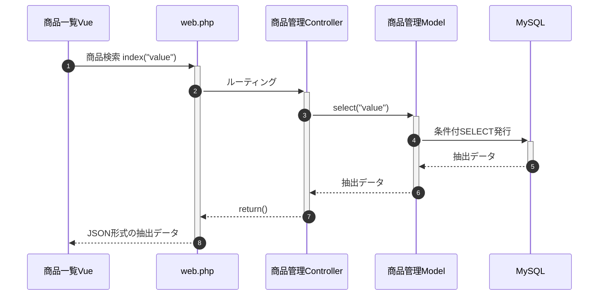

## 商品登録

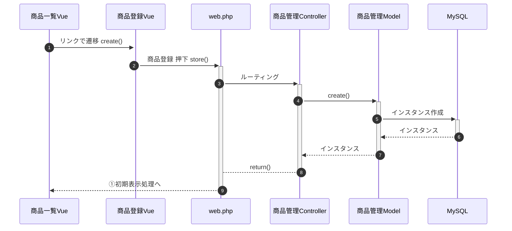

## 商品編集

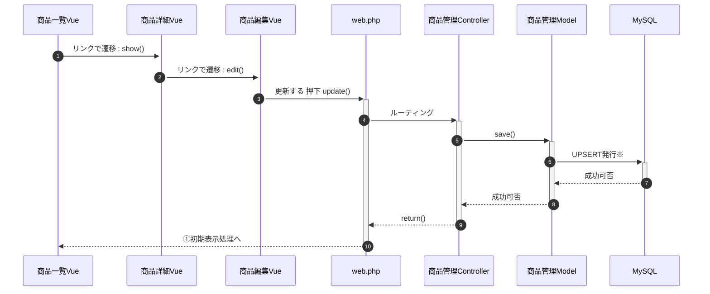

## 商品削除

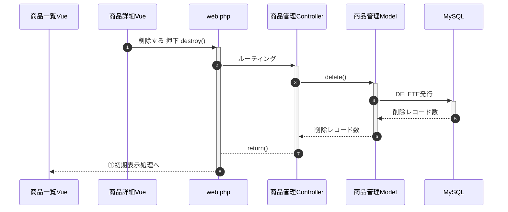

## 商品購入初期表示

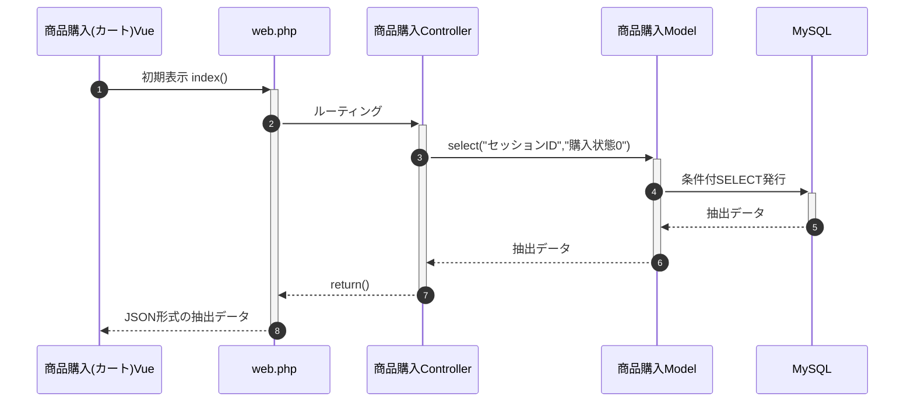

## カートへ追加

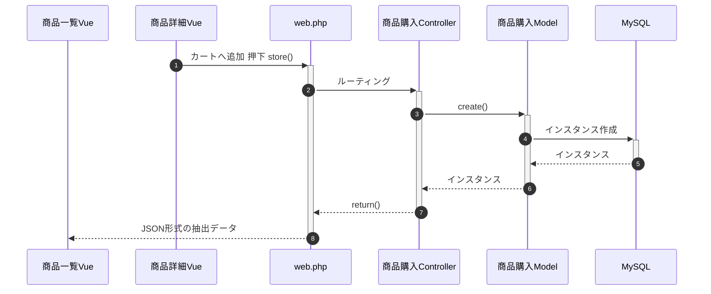

## 商品購入

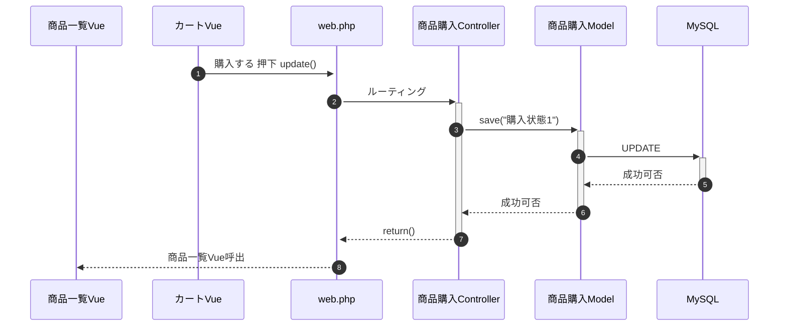

## 購入履歴

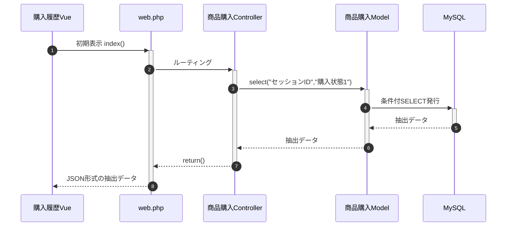
