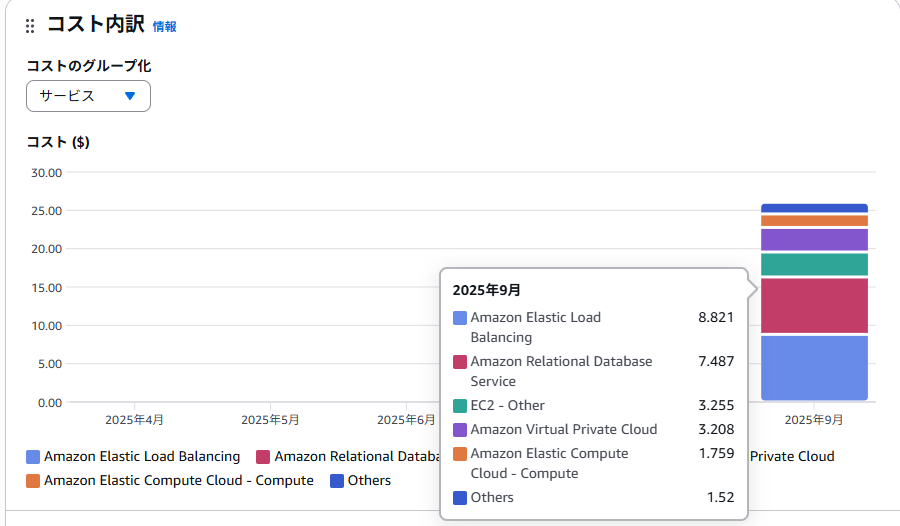

# かかった費用

約5,000円かかってます。思ったよりかなり高い！が感想です。 
ロードバランサの設定とかリリース直前にしたら安く抑えられたのかなと思います。

ドメイン取得は無料でしたが、ネームサーバー登録が高かったです。.workとか中古ドメインにすれば良かった。 
ちなみにインスタンスタイプはt3.micro(2Gib)、EBSは50Gibを使用しています。 
デフォルトで進めるとapacheのインストールでフリーズするのでちょっとだけ拡張してます。